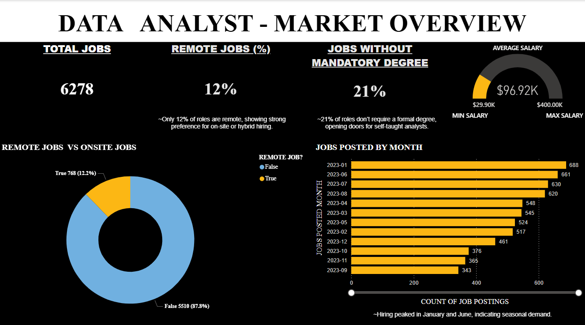
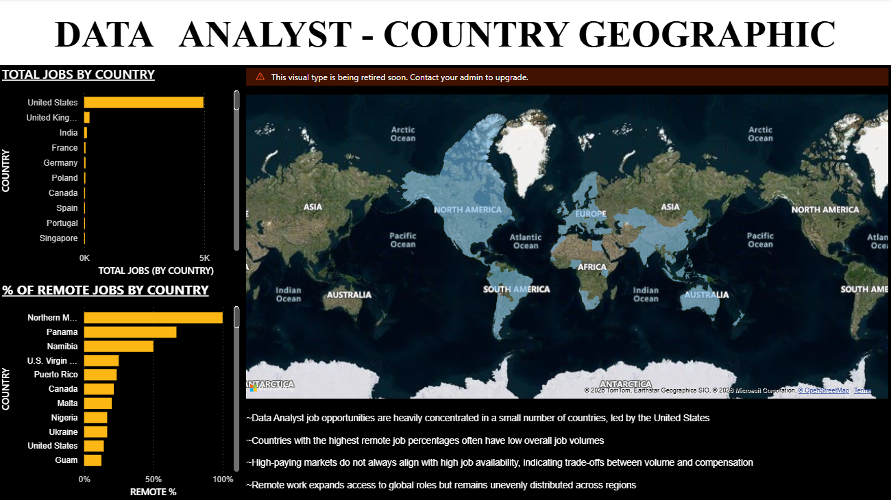

  
 
  

# 📊 Project Overview

The Job Market Intelligence Dashboard is an end-to-end Business Intelligence solution that transforms raw job posting data into strategic insights using Power BI, SQL, and Python.

This project simulates a real-world analytics pipeline designed to help stakeholders understand hiring demand, salary benchmarks, and skill trends across industries.

# 💼 Business Problem

The modern hiring ecosystem generates massive data volumes daily. However:

Organizations struggle to identify talent shortages

Job seekers lack clarity on high-value skills

Salary benchmarks vary across industries and locations

Market hiring patterns remain fragmented

Without centralized analytics, workforce decisions rely heavily on assumptions.

#✅ Business Solution

##This dashboard converts unstructured job posting data into:

✔ Hiring trend intelligence
✔ Skill demand analysis
✔ Salary benchmarking insights
✔ Geographic hiring distribution
✔ Industry growth pattern analysis

---

# 📊 Dashboard Showcase

## 🌍 Market Overview

  

---

## 🧠 Skills Demand Analysis

  

---

## 🌎 Geographic Hiring Insights

  

---

#🎯 Skill Trends

Identifies fastest growing technologies

Detects emerging industry skill requirements

Highlights multi-skill salary advantages

#💵 Salary Intelligence

Compares salaries across job roles

Reveals high-paying skill combinations

Identifies regional salary variations

#🌍 Hiring Hotspots

Maps job concentration across locations

Identifies regional hiring growth

#📊 Industry Hiring Growth

Tracks hiring expansion across sectors

Highlights declining job domains

🛠 Technology Stack
👨‍💻 Data Processing

Python

Pandas

NumPy

#🗄 Database Management

Microsoft SQL Server

Advanced Query Optimization

Analytical Data Modeling

#📊 Visualization & BI

Power BI

Interactive Dashboard Design

Drill-Down Analytics

KPI Monitoring

⚙ Version Control

Git

GitHub

#🔄 Project Workflow
flowchart LR
A[Raw Job Data] --> B[Data Cleaning - Python]
B --> C[SQL Data Modeling]
C --> D[Power BI Dashboard]
D --> E[Business Insights]

#📂 Project Structure
##Job-Market-Intelligence
│
├── data/
│   ├── sample_data/
│
├── sql_queries/
│
├── notebooks/
│
├── docs/
│
├── dashboards/
│
└── README.md

#📊 Business Questions Answered

✔ Which skills are most demanded in the market?
✔ Which job roles offer highest salaries?
✔ Which locations show highest hiring growth?
✔ Which industries are expanding fastest?

💡 Business Impact
🎓 For Job Seekers

Enables skill prioritization

Supports salary negotiation

Guides career path planning

##🏢 For Recruiters

Identifies hiring demand gaps

Supports compensation benchmarking

Enhances workforce planning

##🎓 For Educational Institutions

Aligns curriculum with industry demand

Supports workforce readiness initiatives

##🚀 Future Enhancements

Real-time job market data integration

AI-based salary prediction model

Skill recommendation engine

Hiring trend forecasting

##📥 Dataset Information

Due to GitHub file size limitations, full dataset is excluded.

📌 Sample dataset available inside:

data/sample_data/

▶ How To Run This Project
Clone Repository
git clone https://github.com/ThomasAldo/Data-Analyst-Job-Market-Intelligence.git

Install Dependencies
pip install -r requirements.txt

Load Database

Import SQL schema from sql_queries

Load dataset into SQL Server

Launch Dashboard

Open Power BI file inside /dashboards

##📊 Dashboard Design Highlights

✔ Interactive Filters
✔ KPI Cards
✔ Multi-Page Navigation
✔ Drill-Down Capability
✔ Geographic Mapping
✔ Dynamic Salary Analysis

#👨‍💻 Author

##Thomas Aldo
Computer Science Engineer | Data Analyst

📧 thomasaldo.official@gmail.com
🔗 LinkedIn : Thomas Aldo
⭐ Project Highlights

✔ Real-world hiring dataset
✔ End-to-End Analytics Pipeline
✔ Business Intelligence Storytelling
✔ Recruiter-Ready Portfolio Project

##📜 License

This project is developed for educational and portfolio demonstration purposes.

 ⭐ If you found this project valuable, consider starring the repository! 

  

